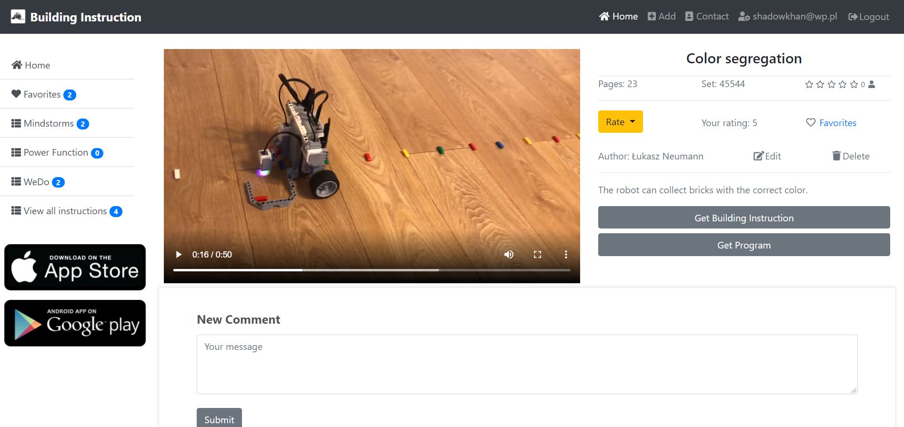

# Lego Building Instructions

Web page Url: https://legobuildinginstruction.azurewebsites.net/

## Table of contents
* [General info](#general-info)
* [Screenshots](#screenshots)
* [Technologies](#technologies)
* [ToDo](#ToDo)
* [Contact](#contact)

## General info
The application allows you to view, upload Lego robot building instructions, download programs, and write comments.

## Screenshots

## Technologies
- ASP.NET Core MVC 5
- Entity Framework
- MSSQL
- Razor
- Bootstrap 4
- Visual studio IDE 2019

## ToDo
- <strike>Login</strike>
- <strike>Comment system</strike>
- <strike>Upload Instructions</strike>
- <strike>Admin panel</strike>
- <strike>Deploy to Azure</strike>
- Rest API
- Testing

## Contact
Created by lukasz.neumann90@gmail.com - feel free to contact me!
