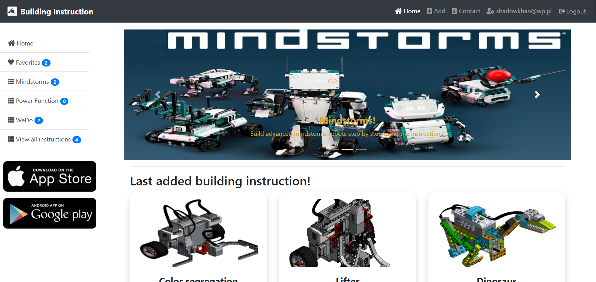

# Lego Building Instructions

## Table of contents
* [General info](#general-info)
* [Screenshots](#screenshots)
* [Technologies](#technologies)
* [ToDo](#ToDo)
* [Contact](#contact)

## General info
The application allows you to view, upload Lego robot building instructions, download programs, and write comments.

## Screenshots

## Technologies
- ASP.NET Core MVC 5
- Entity Framework
- MSSQL
- Razor
- Bootstrap 4
- Visual studio IDE 2019

## ToDo
- Login
- Comment system
- Upload Instructions

## Contact
Created by lukasz.neumann90@gmail.com - feel free to contact me!
